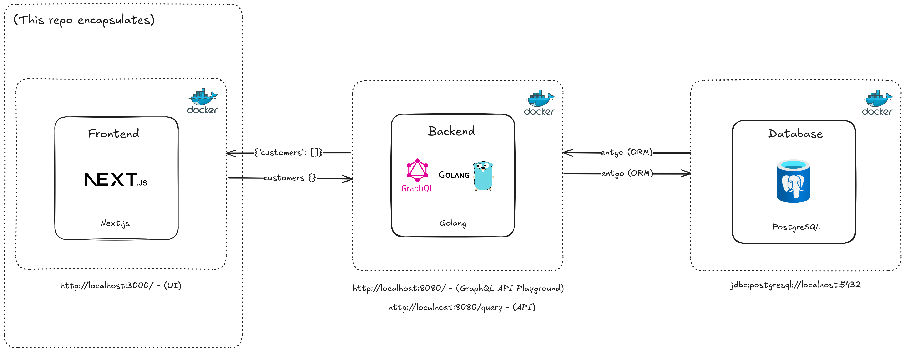

# IOHK Next.js Frontend

## Table of Contents
1. [Introduction](#introduction)
2. [Architecture Diagram](#architecture-diagram)
3. [Prerequisites](#prerequisites)
4. [Installation](#installation)
5. [Running Locally](#running-locally)
6. [Suggestion for Running the Application](#suggestion-for-running-the-application)
7. [Usage](#usage)
8. [Configuration](#configuration)
9. [API Integration](#api-integration)
10. [GraphQL Playground](#graphql-playground)
11. [Core Concepts](#core-concepts)
12. [Components](#components)
13. [Styling](#styling)
14. [Testing](#testing)
15. [Troubleshooting](#troubleshooting)
16. [Environment Variables](#environment-variables)
17. [Contributing](#contributing)
18. [Improvements](#improvements)
19. [Contact Information](#contact-information)

## Introduction

This project is a Next.js 14 frontend application that serves as the user interface for the [Golang backend application](https://github.com/jw-cv/iohk-golang-backend). It utilizes the App Router, React, and TypeScript to create a modern, responsive web application for visualizing the user data. You can access the GraphQL playground at [http://localhost:8080/](http://localhost:8080/) to create, read, update and delete data that this application displays. You can view some example queries and mutations in the [GraphQL Playground](#graphql-playground) section.

## Architecture Diagram



## Prerequisites

Before you begin, ensure you have the following installed:
- [Node.js](https://nodejs.org/) (tested on 22.9.0)
- [npm](https://www.npmjs.com/) (tested on 10.8.3)
- [Docker](https://docs.docker.com/get-docker/) (tested on 27.3.1)
- [Docker Compose](https://docs.docker.com/compose/install/) (tested on 2.29.7)
  - Old syntax (v1) of Docker use: `docker-compose`.
  - New syntax (v2 and later) use: `docker compose`.
  - Please make use of the `make` commands to build and run the project as this takes care of this for you (but it is something to be aware of if you run into any issues).
  - Run `make help` to see the list of available commands.
- [Make](https://www.gnu.org/software/make/) (tested on 4.3, but should work on any version above 3.81)
  - macOS: Included with Xcode Command Line Tools or alternatively via Homebrew with `brew install make`
  - Linux: Use your distribution's package manager (e.g., `sudo apt install make` for Ubuntu)
  - Windows: Install via [Chocolatey](https://chocolatey.org/install) with `choco install make`
- `git clone https://github.com/jw-cv/iohk-golang-backend` the corresponding [backend application](https://github.com/jw-cv/iohk-golang-backend) and run it locally in a docker container (see README.md in that repository for more information).

## Installation

1. Clone the repository and navigate to the project directory:
   ```
   git clone https://github.com/jw-cv/iohk-nextjs-frontend.git
   cd iohk-nextjs-frontend
   ```

## Running Locally

To run the application locally using Docker:

1. Build the Docker images:
   ```
   make build
   ```

2. Start the Docker containers:
   ```
   make run
   ```

   This command will start the Next.js application and display the logs.

3. The application should now be running. You can access it at [http://localhost:3000](http://localhost:3000).

4. To view the logs of the running containers (this is automatically run when you run `make run`):
   ```
   make logs
   ```

5. To stop the application and all associated containers:
   ```
   make stop
   ```

Note: The application uses the `.env.local` file for configuration by default. If you need to modify any settings, you can edit this file before running `make run`.

## Suggestion for Running the Application

- Once you have cloned and run the required Golang backend application: [https://github.com/jw-cv/iohk-golang-backend](https://github.com/jw-cv/iohk-golang-backend):
- Access the GraphQL Playground at [http://localhost:8080/](http://localhost:8080/) to create some data and interact with it via the frontend application at [http://localhost:3000](http://localhost:3000).

- Copy some example queries and mutations in the [GraphQL Playground](#graphql-playground) section to paste into the GraphQL Playground to get you started.

## Usage

This project uses a Makefile to simplify common operations. For a full list of available commands, run:

```
make help
```

Here are some useful commands:

- Build the Docker images:
  ```
  make build
  ```

- Start the Docker containers:
  ```
  make run
  ```

- Stop the Docker containers:
  ```
  make stop
  ```

- View Docker logs:
  ```
  make logs
  ```

## Configuration

The application uses environment variables for configuration. These are set in a `.env.local` file. An important variable is:

```
GRAPHQL_ENDPOINT=http://localhost:8080/query
```

None of this needs to be configured or changed when running the application locally, but is just for your information.

## API Integration

This frontend application integrates with the [Golang backend application](https://github.com/jw-cv/iohk-golang-backend). The API calls are made using the `fetch` function in the `app/api/users/route.ts` file. GraphQL queries are used to fetch user data.

## GraphQL Playground

The GraphQL API can be explored using GraphQL Playground, which is available when running the application locally. You can perform CRUD (Create, Read, Update, Delete) operations on the customer data. To access it:

1. Start the application using `make docker-up`
2. Open a web browser and navigate to [http://localhost:8080/](http://localhost:8080/)
3. These changes will be reflected in the frontend application running at [http://localhost:3000](http://localhost:3000).

Here are some example operations you can perform (you can copy these into the playground and run them to generate new data and see the results on the frontend):

### Create a Customer

```
mutation CreateCustomer {
  createCustomer(input: {
    name: "John"
    surname: "Doe"
    number: 123
    gender: MALE
    country: "USA"
    dependants: 2
    birthDate: "1990-01-01"
  }) {
    id
    name
    surname
    number
    gender
    country
    dependants
    birthDate
  }
}
```

### Get All Customers

```
query GetAllCustomers {
  customers {
    id
    name
    surname
    number
    gender
    country
    dependants
    birthDate
  }
}
```

### Update a Customer

```
mutation UpdateCustomer {
  updateCustomer(
    id: "1", 
    input: {
      name: "Jane"
      surname: "Smith"
      number: 456
      gender: FEMALE
      country: "Canada"
      dependants: 1
      birthDate: "1985-05-15"
    }
  ) {
    id
    name
    surname
    number
    gender
    country
    dependants
    birthDate
  }
}
```

### Delete a Customer

```
mutation DeleteCustomer {
  deleteCustomer(id: "1")
}
```

## Core Concepts

This project is built on top of several core concepts, including:

- Next.js 14 App Router
- React
- TypeScript
- Tailwind CSS
- Docker

The application follows a component-based architecture using React and Next.js. It uses the App Router for routing and server-side rendering capabilities.

## Components

Key components include:

- `LandingPage`: The main entry point of the application, displaying an overview and navigation options (`components/landing-page.tsx`)
- `Users`: Displays user data in a table format (`components/users/users.tsx`)
- `UsersOverview`: Provides a context for managing user data state (`components/users-overview/users-overview.tsx`)

## Styling

The application uses Tailwind CSS and Shadcn UI for styling. Global styles are defined in `app/globals.css`.

## Testing

To run the test suite:

```
npm test
```

To run the test suite in watch mode:

```
npm run test:watch
```

To run tests with coverage:

```
npm run test:coverage
```

## Troubleshooting

- If you encounter issues with Docker, ensure that the Docker daemon is running on your machine.
- If you see API connection errors, check that the backend application is running and that your `.env.local` file has the correct `GRAPHQL_ENDPOINT` value.

## Environment Variables

The project uses different environment files for local development and production:

- `.env.local`: Used for local testing (committed to the repository)
- `.env.production`: Used for running the application locally and in production in Docker (committed to the repository)

To set up your environment:

1. For local development (running with `npm run dev`), use `.env.local`:
   ```
   NEXT_PUBLIC_GRAPHQL_ENDPOINT=http://localhost:8080/query
   ```

2. For Docker environments (including running locally via `make run` or in production), use `.env.production`:
   ```
   NEXT_PUBLIC_GRAPHQL_ENDPOINT=http://host.docker.internal:8080/query
   ```

The application will automatically use the appropriate environment file based on the context (local development or Docker).

- Please note: You don't need to adjust any of this to run the application - this is just for your information.


## Contributing

Contributions are welcome! Please feel free to submit a Pull Request.

1. Fork the repository
2. Create your feature branch (`git checkout -b feature/amazing-feature`)
3. Commit your changes (`git commit -m 'Add some amazing feature'`)
4. Push to the branch (`git push origin feature/amazing-feature`)
5. Open a Pull Request

Please adhere to the existing code style and include appropriate tests for new features.

## Improvements

- Implement full CRUD functionality: Enhance the frontend to support complete create, read, update, and delete operations by fully integrating the backend's GraphQL API, enabling efficient data management through the user interface.
- Introduce authentication and authorization: Add user authentication and role-based authorization to ensure secure and controlled access to data and system functionality.
- Refine data filtering: Integrate a datepicker component to enable more precise filtering by date, improving the accuracy and usability of data insights.
- Optimize deployment workflow: Provide detailed deployment instructions for AWS and Vercel, ensuring a streamlined and efficient process for setting up production environments.

## Contact Information

For any questions you may have, please feel free to contact me at [joshwillems.cv@gmail.com](mailto:joshwillems.cv@gmail.com).
